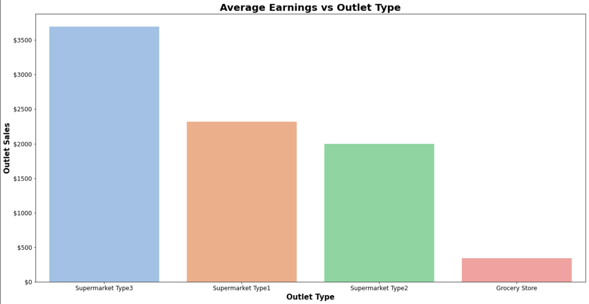

# Sales Predictions

Ashley Heinrich
 
## Overview: 

This project was designed to help a retailer make predictions about future sales. It examined possible item trends that were linked to higher sales and identified both popular items and markets that were most lucrative. 

Data was preprocessed for machine learning and regression models were used to examine relationships between variables of interest related to outlet sales. Challenges faced include significant amounts of missing data in Outlet Size and required assumptions for imputations. There were also many outliers present in Outlet Sales that may have influenced regression metrics and models. 

## Data:

Link: https://drive.google.com/file/d/1syH81TVrbBsdymLT_jl2JIf6IjPXtSQw/view

For this dataset there were 8,523 rows and 12 columns

**Data Dictionary:**

## Methods:

Data was initially explored and cleaned, temporarily imputing missing values with mean for Item weight and a placeholder for Outlet Size. 

Visualizations were made including histograms, bar plots, heat maps and box plots to further explore data and find any correlations, product or market trends that could be linked to higher sales. 

Data was reloaded to prevent leakage and split during preprocessing for machine learning. Target was set as Item Outlet Sales and the rest were as features. Missing data in Outlet size was imputed with a most frequent value and treated as an ordinal feature. Mean was used to impute the missing values from Item Weight. Due to the quantity of missing values, they were not dropped. The Item identifier column was dropped due to high cardinality. 

A linear regression model and regression tree model were created to examine relationships between variables of interest and outlet sales. 
 
## Results:

**Visual 1: Average Item Earnings** 

Examining Item type and outlet sales. Results were that the highest selling items are the starchy foods category and the lowest is the others category.

**Visual 2: Average Earnings vs Outlet Type**

Supermarket type 3 have the highest sales while Grocery Stores have the lowest.

**Visual 3: Amount of Each Outlet Type**

There are more Type 1 supermarkets and grocery stores, yet Type 3 has significantly higher earnings.

**Visual 4: Supermarket Type 3 Sales**

Breakfast foods are the highest earners, followed by the fruits and vegetables category. The lowest earning products in this market are seafood and those in the others category. 

Further inspection of Type 3 supermarkets showed low fat breakfast products as the highest sold and lowest as regular seafood. Overall, both low fat and regular fat products have strong sales for this supermarket type. 

## Machine Learning

**Regression Tree Model:**

The regression tree model had a better performance on test data than a linear regression model. To optimize performance of the model a max_depth of 5 was found and instantiated. Final metrics are shown below. 

The R2 score is somewhat low and this model can only account for about 59% of the variation in y_test using the features in X_test. 

The RMSE is higher than the MAE and which shows there is variance and the model is making some large errors. 

The MAE shows that the model has an average error of approximately $738 between the predictions and the actuals in this data set. Whether these results are satisfactory or not is dependent upon how success is defined by the retailer and business. 

 
## Recommendations:

To increase sales, based on data exploration, recommendations would include focusing on more diversity in higher selling categories or better product placement/marketing, etc of lower selling items to increase sales. 

Another recommendation is to look further into Type 3 markets and how they are achieving higher sales including sales strategies, location, product placement, etc. These properties may be applied to other outlets with higher volume like Type 1 where they can have more impact. Business can alternatively be pivoted toward acquiring more Type 3 markets. 

 
## Limitations and Next Steps:

Limitations of this project include the quantities of missing data that had to be imputed and their subsequent effect on the integrity of the data. The lack of access to the retailer for general clarification questions/verification and the assumptions that had to be made on their behalf. Finally, the limitations of the regression models working with this dataset and that other models may or may not have performed better. 
 
## Linear Regression Coefficients Plot:

